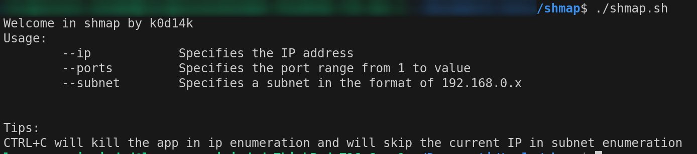
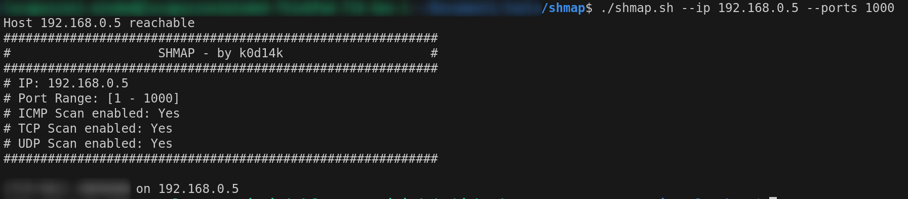
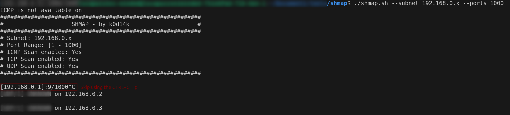

# SHmap

<div style="text-align:end">

[]()
&nbsp;&nbsp;&nbsp;&nbsp;&nbsp;
[]()

</div>

## Description
SHmap is a bash script that allows to perform a net-scan in those systems where isn't possible to install nmap.

It performs three kinds of scan:

1. TCP Scan 
2. UDP Scan (if netcat is installed) 
3. ICMP Scan (if ping is installed)

## Usage



### Enumeration by IP
The user provides an IP address and a value for the attribute ports and the script will check all ports between 1 and the provided value (1000 in the example).

```bash
./shmap.sh --ip 1.2.3.4 --ports 1000 # 1<= port <= 1000
```

Follows a screenshot showing how the IP execution mode works.



### Enumeration by Subnet
The user provides an IP address for the subnet replacing the last group with a 'x' and a value for the attribute ports and the script will check all ports between 1 and the provided value (1000 in the example) for every IP address in the range [1:254].

```bash
./shmap.sh --subnet 1.2.3.x --ports 1000 # 1<= port <= 1000 for x in range 1..254
```

The following screenshot shows how the subnet execution mode works.

Screenshot:

